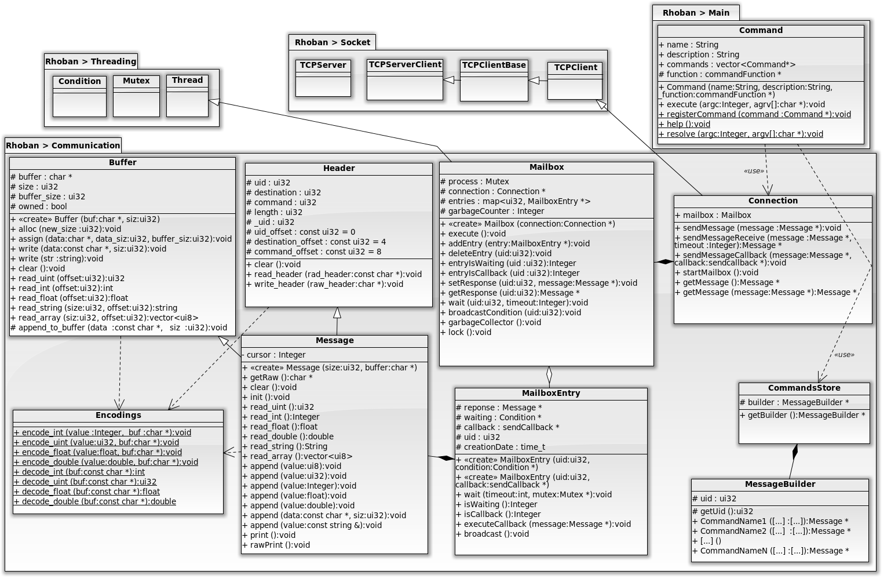

.. _sdk:

Documentation: SDK
==================

.. toctree::
    :maxdepth: 2

    prise_en_main
    commandes
    communication
    configurations
    moteurs
    mouvements

Les codes sources des SDK (Software Development Kit) Python et C++ sont récupérables dans la rubrique :ref:`telechargements`.

Utilisation du SDK
~~~~~~~~~~~~~~~~~~

Exécution du programme
----------------------

Bla

Architecture du SDK
~~~~~~~~~~~~~~~~~~~

Diagramme de classes
--------------------

Réalisé avec `SoftwareIdeasModeler`.

Description des modules
-----------------------

Bla

La gestion du motion tracking
~~~~~~~~~~~~~~~~~~~~~~~~~~~~~

Le logiciel Tracking Tools embarque un système de streaming des
données via VRPN. La classe Tracker_Client a pour but de récupérer
et traiter les données streamée.

L'initialisation
----------------

*Tracker_Client(string name,string ip, int port, int cap)*

Pour chaque "rigid body" tracké par le logiciel il faut instancier un
objet. . Le constructeur prend l'adresse de la machine sur laquelle
tourne le logiciel et un port sur lequel écouter, la connexion est
donc gérée à ce moment.  Le dernier argument
