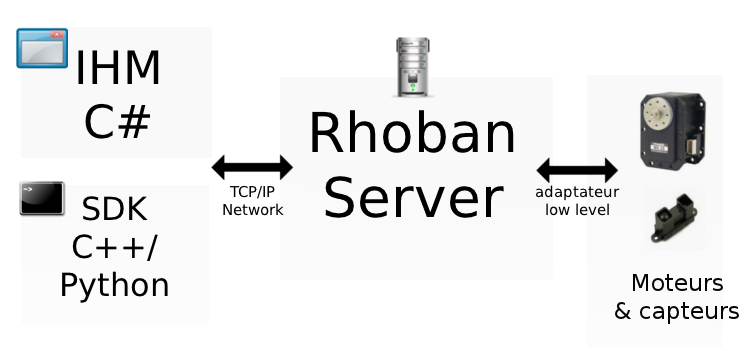

Architecture
============

Présentation
~~~~~~~~~~~~

Voici un schéma représentant l'architecture globale :

On y retrouve les composants suivants :

========================= =============================================
Nom du composant          Description
========================= =============================================
Moteurs & capteurs        L'ensemble des éléments mécaniques et éléctroniques.
                          De manière plus générale, votre robot.

Rhoban Server             :ref:`Rhoban Server <server>` exploite le matériel 
                          à l'aide d'un adaptateur bas niveau, qui est une couche 
                          logicielle capable de communiquer avec une architecture 
                          spécifique, comme par exemple :

                          - Une communication série Dynamixel
                          - Une Roboard (échantillonage ADC)
                          - Une MMnet (échantillonage ADC, bus série...)

                          Le serveur est alors joignable sur le réseau TCP/IP,
                          on peut lui parler à l'aide du :ref:`protocole <protocol>`.

IHM                       L':ref:`IHM <ihm>` est un logiciel graphique permettant de
                          paramétrer un robot (configuration bas niveau) et de 
                          concevoir des mouvements.

SDK                       Le :ref:`SDK <sdk>` est une suite de développement logiciel
                          qui vous permettra d'écrire du code, en C++ ou en Python, 
			  ce qui vous permettra de piloter votre robot.
========================= =============================================

Interêts de l'architecture
~~~~~~~~~~~~~~~~~~~~~~~~~~

Cette architecture offre une certaine souplesse. En effet, le serveur Rhoban peut être
utilisé directement sur un ordinateur, le robot sera alors piloté et supervisé depuis
ce même ordinateur. Il peut également être placé à bord du robot, mais piloté depuis l'extérieur,
le robot sera alors "semi-autonome", dans le sens ou la couche bas niveau sera embarquée, 
mais le contrôle supervisé sera piloté depuis un ordinateur, ce qui permet d'employer
une plus grande puissance de calcul et de simplifier le développement. Enfin, le code
de pilotage que vous écrirez à l'aide du SDK pourra également être totalement embarqué, 
faisant du robot une entité entièrement autonome.

Notez également que le serveur accepte plusieurs clients simultanément, ce qui peut, 
par exemple, vous permettre d'écrire un programme pour piloter le robot et un autre pour
le monitorer. Aussi, la même machine peut gérer simultanément une flotte de robot en
établissant plusieures connexions en parallèle.

